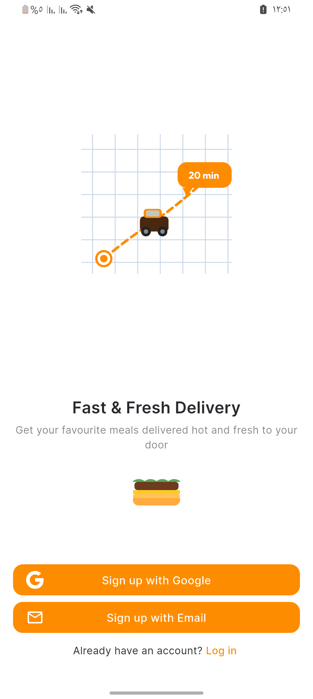
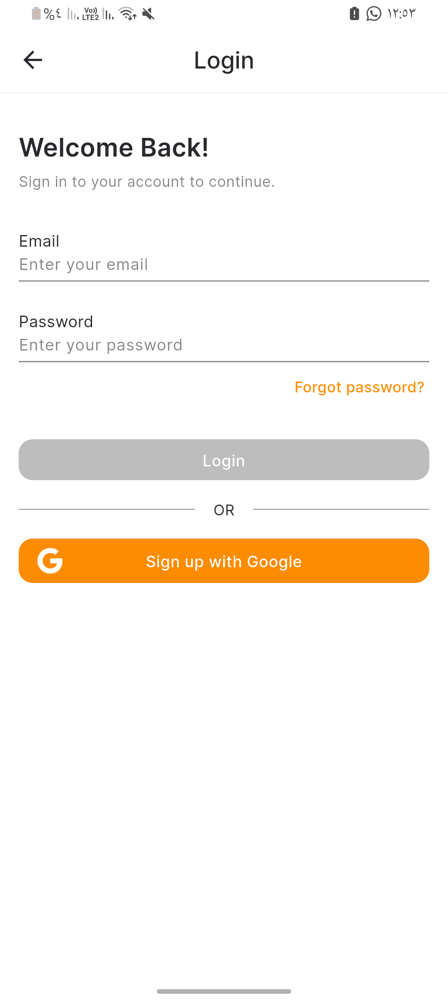
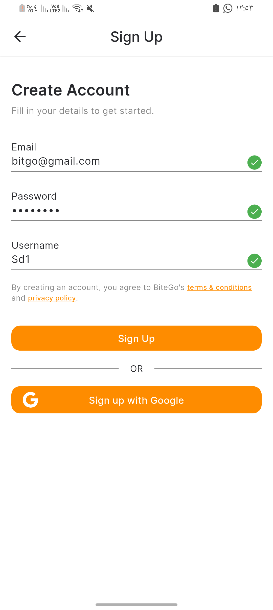
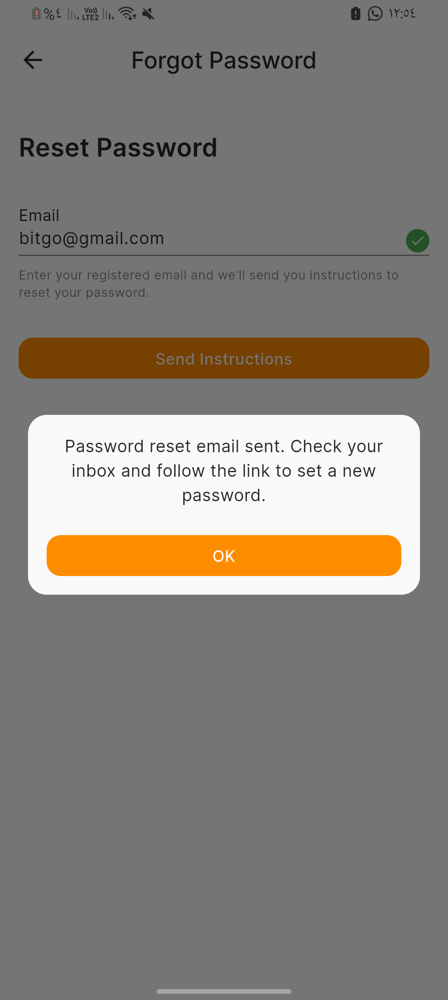
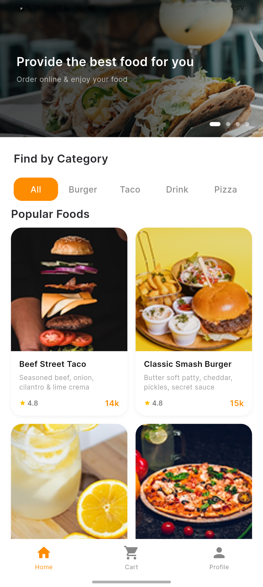
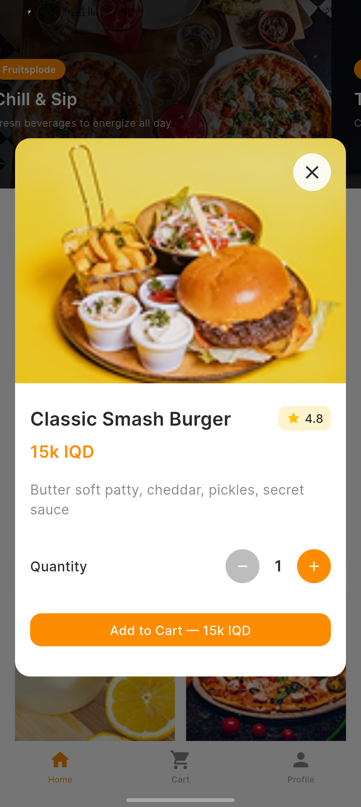
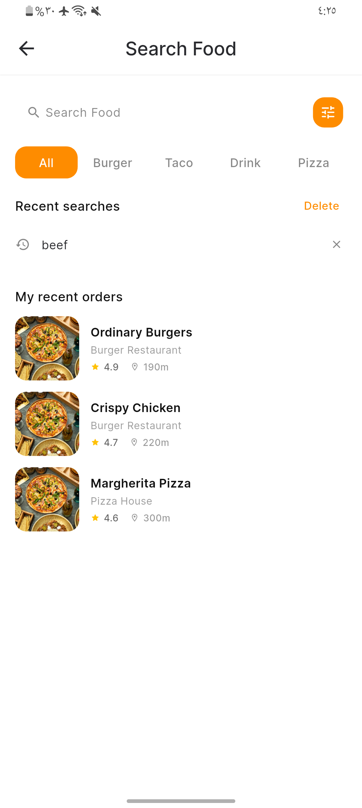
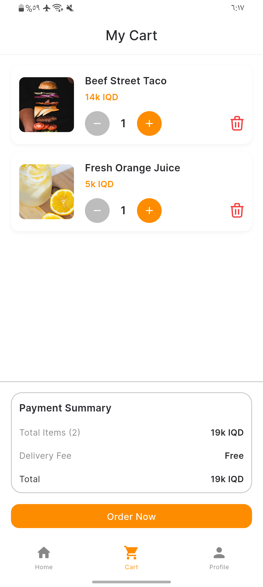
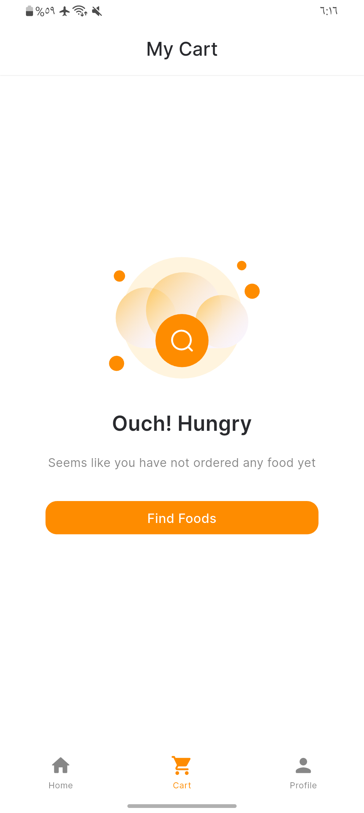



  

## 📷 Screenshots

### Auth

| Pre Auth | Login | Sign Up | Forgot Pass |
|:---:|:---:|:---:|:---:|
|  |  |  |  |

### Home

| Home | Food Details | Search | Cart | Cart Empty |
|:---:|:---:|:---:|:---:|:---:|
|  |  |  |  |  |

# Project Roadmap

<table style="border-collapse: separate; border-spacing: 12px; width: 100%;">
  <tr>
    <td valign="top" style="border: 1px solid #d0d7de; padding: 16px;">
      <b style="color:#FE8C00;">01. Auth</b>  
      <b>Status:</b> ✅ Completed  
      <b>Contains:</b> 
      • Email Login 
      • Email Signup 
      • Google Login 
      • Forgot Password
    </td>
    <td valign="top" style="border: 1px solid #d0d7de; padding: 16px;">
      <b style="color:#FE8C00;">02. Home</b>  
      <b>Status:</b> ✅ Completed   
      <b>Contains:</b> 
      • Food Types 
      • Food List
    </td>
    <td valign="top" style="border: 1px solid #d0d7de; padding: 16px;">
      <b style="color:#FE8C00;">03. Food Details</b>  
      <b>Status:</b> ✅ Completed  
      <b>Contains:</b> 
      • Food Information 
      • Food Images 
      • Food Price 
      • Food Description 
      • Add to Favorites 
      • Add to Cart
    </td>
    <td valign="top" style="border: 1px solid #d0d7de; padding: 16px;">
      <b style="color:#FE8C00;">04. Search</b>  
      <b>Status:</b> ✅ Completed  
      <b>Contains:</b> 
      • Search Food 
      • Search Results
    </td>
  </tr>
  <tr>
    <td valign="top" style="border: 1px solid #d0d7de; padding: 16px;">
      <b style="color:#FE8C00;">05. Favorites</b>  
      <b>Status:</b> ⬜ Not Started  
      <b>Contains:</b> 
      • Favorite Foods 
      • Remove from Favorites 
      • Open Food Details
    </td>
    <td valign="top" style="border: 1px solid #d0d7de; padding: 16px;">
      <b style="color:#FE8C00;">06. Cart</b>  
      <b>Status:</b> ✅ Completed  
      <b>Contains:</b> 
      • Cart Items 
      • Add Item 
      • Remove Item 
      • Increase Quantity 
      • Decrease Quantity 
      • Total Price
    </td>
    <td valign="top" style="border: 1px solid #d0d7de; padding: 16px;">
      <b style="color:#FE8C00;">07. Delivery Map</b>  
      <b>Status:</b> ⬜ Not Started  
      <b>Contains:</b> 
      • Map 
      • Current Location 
      • Select Delivery Location 
      • Delivery Address
    </td>
    <td valign="top" style="border: 1px solid #d0d7de; padding: 16px;">
      <b style="color:#FE8C00;">08. Payment Methods</b>  
      <b>Status:</b> ⬜ Not Started  
      <b>Contains:</b> 
      • Payment Methods 
      • Select Payment Method 
      • Cash Payment 
      • Card Payment
    </td>
  </tr>
  <tr>
    <td valign="top" style="border: 1px solid #d0d7de; padding: 16px;">
      <b style="color:#FE8C00;">09. Profile</b>  
      <b>Status:</b> ⬜ Not Started  
      <b>Contains:</b> 
      • Personal Data 
      • Settings 
      • Help Center
    </td>
    <td valign="top" style="border: 1px solid #d0d7de; padding: 16px;">
      <b style="color:#FE8C00;">10. Notifications</b>  
      <b>Status:</b> ⬜ Not Started  
      <b>Contains:</b> 
      • Notifications List 
      • Order Notifications 
      • General Notifications 
      • Mark as Read
    </td>
    <td valign="top" style="border: 1px solid #d0d7de; padding: 16px;">
      <b style="color:#FE8C00;">11. Call & Chat List</b>  
      <b>Status:</b> ⬜ Not Started  
      <b>Contains:</b> 
      • Call List 
      • Chat List 
      • Open Chat 
      • Call
    </td>
    <td valign="top" style="border: 1px solid #d0d7de; padding: 16px;">
      <b style="color:#FE8C00;">12. Chat View</b>  
      <b>Status:</b> ⬜ Not Started  
      <b>Contains:</b> 
      • Messages 
      • Send Message 
      • Receive Message 
      • Text Input
    </td>
  </tr>
</table>
